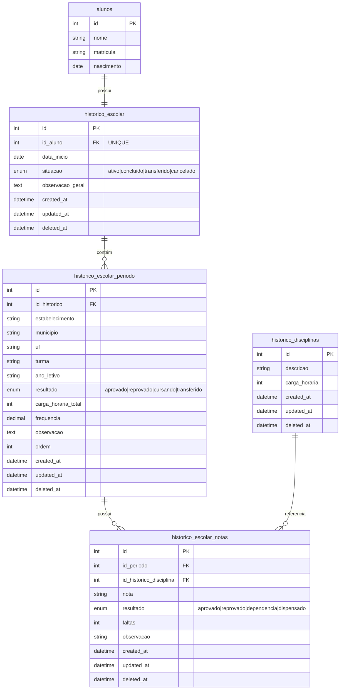

# Diagrama ER - Módulo Histórico Escolar

## Diagrama de Relacionamento de Entidades



## Cardinalidade dos Relacionamentos

### 1. Aluno → Histórico Escolar
- **Tipo:** Um para Um (1:1)
- **Descrição:** Cada aluno possui um único histórico escolar principal
- **Regra:** Um aluno não pode ter mais de um histórico ativo

### 2. Histórico Escolar → Períodos
- **Tipo:** Um para Muitos (1:N)
- **Descrição:** Um histórico pode conter múltiplos períodos letivos
- **Exemplo:** Aluno cursou 1º ano (2021), 2º ano (2022), 3º ano (2023)

### 3. Período → Notas
- **Tipo:** Um para Muitos (1:N)
- **Descrição:** Cada período possui múltiplas disciplinas com notas
- **Exemplo:** No 1º ano, cursou Matemática, Português, História, etc.

### 4. Disciplina → Notas
- **Tipo:** Um para Muitos (1:N)
- **Descrição:** Uma disciplina pode aparecer em múltiplas notas de diferentes períodos
- **Exemplo:** "Matemática" é usada em vários períodos de vários alunos

## Fluxo de Dados

```
┌─────────────┐
│   Aluno     │
│  (João)     │
└──────┬──────┘
       │ 1:1
       ↓
┌─────────────────────────┐
│  Histórico Escolar      │
│  - Situação: Ativo      │
│  - Início: 2021         │
└──────────┬──────────────┘
           │ 1:N
           ↓
    ┌──────────────────────────┐
    │  Período 1 (2021)        │
    │  - Escola A              │
    │  - 1º Ano                │
    │  - Resultado: Aprovado   │
    └────────┬─────────────────┘
             │ 1:N
             ↓
      ┌──────────────────┐
      │  Matemática: 8.5 │
      │  Português: 9.0  │
      │  História: 7.5   │
      └──────────────────┘
    
    ┌──────────────────────────┐
    │  Período 2 (2022)        │
    │  - Escola B              │
    │  - 2º Ano                │
    │  - Resultado: Aprovado   │
    └────────┬─────────────────┘
             │ 1:N
             ↓
      ┌──────────────────┐
      │  Matemática: 7.0 │
      │  Português: 8.5  │
      │  Geografia: 9.0  │
      └──────────────────┘
```

## Índices e Performance

### Tabela: historico_escolar
```sql
PRIMARY KEY: id
INDEX: idx_aluno (id_aluno)
INDEX: idx_situacao (situacao)
INDEX: idx_deleted (deleted_at)
```

### Tabela: historico_escolar_periodo
```sql
PRIMARY KEY: id
INDEX: idx_historico (id_historico)
INDEX: idx_ano_letivo (ano_letivo)
INDEX: idx_ordem (ordem)
INDEX: idx_deleted (deleted_at)
```

### Tabela: historico_escolar_notas
```sql
PRIMARY KEY: id
INDEX: idx_periodo (id_periodo)
INDEX: idx_disciplina (id_historico_disciplina)
UNIQUE: uk_periodo_disciplina (id_periodo, id_historico_disciplina, deleted_at)
```

### Tabela: historico_disciplinas
```sql
PRIMARY KEY: id
INDEX: idx_deleted (deleted_at)
```

## Consultas Comuns Otimizadas

### 1. Buscar histórico completo de um aluno
```sql
SELECT h.*, a.nome AS nome_aluno
FROM historico_escolar h
INNER JOIN alunos a ON a.id = h.id_aluno
WHERE h.id_aluno = ? AND h.deleted_at IS NULL;
```

### 2. Buscar todos os períodos de um histórico
```sql
SELECT * 
FROM historico_escolar_periodo
WHERE id_historico = ? AND deleted_at IS NULL
ORDER BY ordem ASC;
```

### 3. Buscar notas de um período específico
```sql
SELECT 
  n.*,
  d.descricao AS disciplina,
  d.carga_horaria
FROM historico_escolar_notas n
INNER JOIN historico_disciplinas d ON d.id = n.id_historico_disciplina
WHERE n.id_periodo = ? AND n.deleted_at IS NULL
ORDER BY d.descricao;
```

### 4. Relatório completo do histórico
```sql
SELECT 
  h.id AS id_historico,
  a.nome AS aluno,
  a.matricula,
  p.ano_letivo,
  p.turma,
  p.estabelecimento,
  p.resultado AS resultado_periodo,
  d.descricao AS disciplina,
  n.nota,
  n.resultado AS resultado_disciplina
FROM historico_escolar h
INNER JOIN alunos a ON a.id = h.id_aluno
INNER JOIN historico_escolar_periodo p ON p.id_historico = h.id
INNER JOIN historico_escolar_notas n ON n.id_periodo = p.id
INNER JOIN historico_disciplinas d ON d.id = n.id_historico_disciplina
WHERE h.id_aluno = ?
  AND h.deleted_at IS NULL
  AND p.deleted_at IS NULL
  AND n.deleted_at IS NULL
ORDER BY p.ordem, d.descricao;
```

## Regras de Negócio

### 1. Histórico Principal
- ✅ Cada aluno pode ter apenas 1 histórico ativo
- ✅ Histórico é criado automaticamente ao adicionar primeiro período
- ✅ Situação pode ser: ativo, concluído, transferido, cancelado

### 2. Períodos
- ✅ Períodos são ordenados cronologicamente (campo `ordem`)
- ✅ Resultado pode ser: aprovado, reprovado, cursando, transferido
- ✅ Carga horária total é calculada somando disciplinas
- ✅ Frequência é percentual (0.00 a 100.00)

### 3. Notas
- ✅ Não pode duplicar disciplina no mesmo período
- ✅ Resultado pode ser: aprovado, reprovado, dependência, dispensado
- ✅ Faltas são contabilizadas por disciplina
- ✅ Nota pode ser numérica ou conceitual (A, B, C, etc.)

### 4. Disciplinas
- ✅ Disciplinas são cadastradas separadamente
- ✅ Podem ser reutilizadas em múltiplos períodos
- ✅ Carga horária é informativa (não obrigatória)

## Integridade Referencial

Embora o MyISAM não suporte Foreign Keys nativas, a integridade é mantida via:

1. **Validação na aplicação** (Controllers e Models)
2. **Soft Delete** (deleted_at) - evita exclusão de dados referenciados
3. **Índices** - garantem performance nas consultas de relacionamento
4. **Constraints únicos** - previnem duplicações

## Migração de Dados

A migração preserva:
- ✅ Todos os dados existentes
- ✅ Timestamps originais
- ✅ Registros deletados (soft delete)
- ✅ Relacionamentos entre tabelas

Backups automáticos:
- `historico_escolar_backup`
- `historico_escolar_notas_backup`
